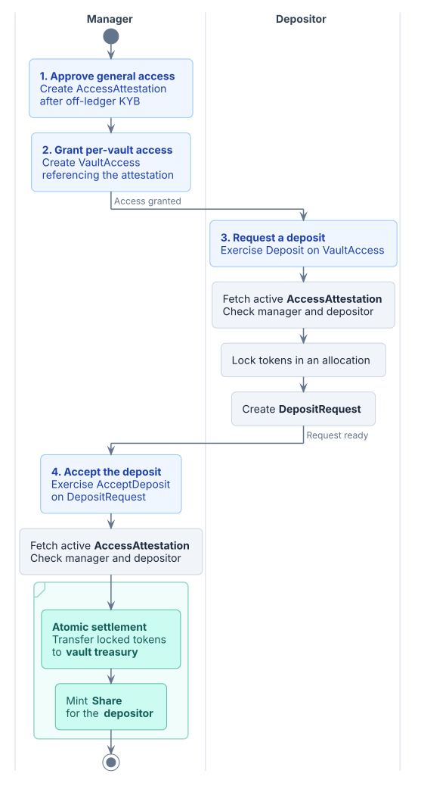
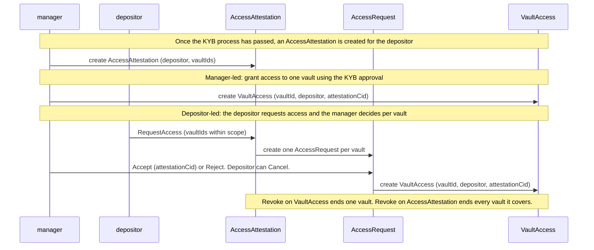
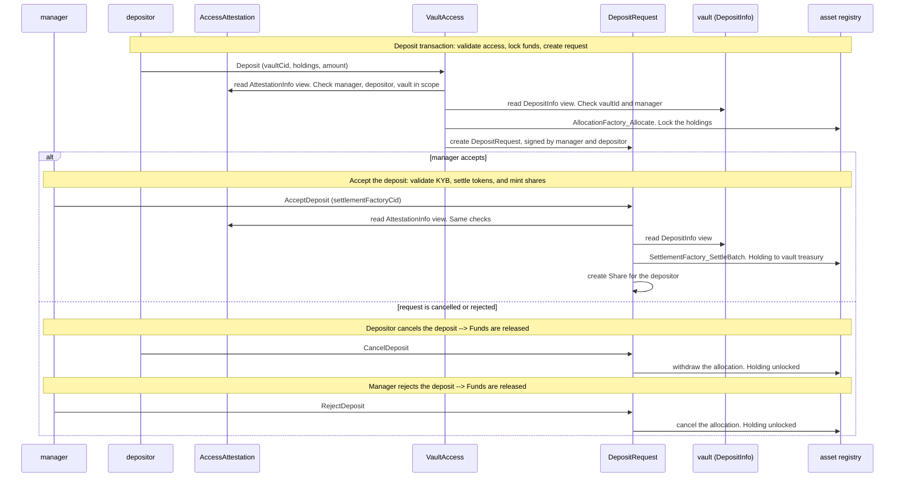

# Vault Access

## Overview

In Daml, explicit disclosure lets a party read a contract it is not a
stakeholder of, and nothing more: it grants visibility, never authority. A
depositor who is shown a vault still cannot exercise anything on it. Making
every depositor an observer of the vault would grant visibility too, at the
cost of a member list on the vault that grows with every admission and a
contract that changes every time one joins or leaves.

This pattern gives a party both things at once, visibility of a private
contract and the authority to act on it, through a per-user permission
contract that the owner issues and can revoke. The vault stays private and
untouched, and the application scales to any number of users. Vaults are the
example here; the same shape applies to any private contract whose owner
wants to admit users one by one.

For a compliant and access-controlled vault, a manager needs to control who
can interact with the vault after a KYB process is enforced. The pattern
composes two access gates: a general KYB gate, represented by
`AccessAttestation`, and a per-vault permission gate, represented by
`VaultAccess`. Each admitted depositor holds a `VaultAccess`, opens deposits
by exercising a choice on it, and each permission references the depositor's
`AccessAttestation` from the same manager.

### Two ways to grant access

- **Manager-led.** The manager creates a `VaultAccess` directly.
- **Depositor-led.** The depositor exercises `RequestAccess` on their
  attestation with a list of vault IDs, creating one `AccessRequest` per
  vault. The manager can `Accept` or `Reject` each request independently;
  `Accept` creates the corresponding `VaultAccess`. The depositor can
  `Cancel` any pending request.

Both paths end in the same permission contract, so everything downstream is
identical.

### General access: KYB

`AccessAttestation` records the manager's approval following an off-ledger KYB
process. It is signed by the manager, observed by the depositor, and lists
the vaults the approval covers in `vaultIds`. It can carry an optional
`evidenceHash`; supporting evidence stays off-ledger.

The attestation is also the depositor's bulk entry point: `RequestAccess`
takes a list of vault IDs and creates one `AccessRequest` per vault in a
single transaction, provided every vault is within the attestation's scope.
The attestation remains active, and each request awaits the manager's decision.
An `AccessRequest` can also be created directly by the depositor. Its `Accept`
always validates the attestation supplied by the manager at approval time.

To change the scope, the manager can revoke the attestation and create a new
one. Permissions and deposit requests referencing the revoked contract stop
validating. Pending access requests can be accepted using a new attestation
that covers the requested vault.


### Per-vault access

`VaultAccess` grants a specific depositor access to one vault. It holds a
required `attestationCid`, checked when the depositor exercises `Deposit`.
The request preserves that reference, and `AcceptDeposit` checks it again.
Both checks read the attestation through the `AttestationInfo` view and
verify its manager, its depositor, and that the vault is within its scope.

Revoking `VaultAccess` stops new deposits through that permission. Access to
other vaults is unaffected, and existing requests can still be accepted while
their attestation remains active. The manager can reject those requests individually.

Revoking the attestation blocks new deposits and acceptance of pending
requests referencing it, across all vaults using that approval.
`CancelDeposit` and `RejectDeposit` remain available to release locked funds.
Existing permissions remain on the ledger; a replacement attestation requires
new permissions pointing to its contract ID.

### Using vault access



[Diagram source](images/deposit-flow.puml)

Further deposits require both `VaultAccess` and its attestation to remain active.

## The pattern

- A general attestation scoped to a list of vaults, and a per-vault
  permission, both signed by the manager and observed by the depositor.
- An optional request contract signed by the depositor and observed by the
  manager, whose `Accept` creates the permission. The manager decides; the
  depositor can withdraw.
- The depositor's operations are choices on the permission, controlled by the
  depositor. Exercising one combines the manager's authority (signatory) with
  the depositor's (controller).
- Each choice reads the target vault through an interface and checks that it
  matches the permission. The depositor is not a stakeholder of the vault, so
  the vault is supplied by explicit disclosure at submission time, or the
  depositor is made an observer of it. The same applies to the registry's
  allocation factory.
- The manager can revoke a per-vault permission or the shared KYB approval.

## Benefits

- The vault stays private and never carries a member list.
- Admitting or removing a depositor never modifies the vault contract.
- `Deposit` creates a request signed by both parties in one submission.
  The manager then decides whether to accept it and settle.
- A depositor can act only on the vault it was admitted to.

## Implementation example

This example uses the following simplifications and supporting contracts:

- The one operation shown is `Deposit`. It locks token-standard holdings in an
  allocation and opens a `DepositRequest`. Other operations follow the same
  shape.
- Shares are a token-standard holding minted at par (one share per unit
  deposited). The pattern focuses on access, so there is no exchange rate, no
  NAV, and no rounding rule in the example.
- The permission and request reference the attestation as a
  `ContractId AttestationInfo`, a view-only interface from this pattern's
  `interface/` package, so they never import the attestation template. The
  optional evidence hash stays in the attestation.

### Access flow

How a depositor ends up holding a `VaultAccess`, by either path.



### Deposit checks

What `Deposit` and `AcceptDeposit` verify, and what settles when the
manager accepts.



### Parties

- `manager`: issues KYB attestations and permissions, decides requests, and
  executes settlement.
- `depositor`: can request access, exercises `Deposit`, can cancel its own
  requests.

### Contracts

- `AttestationInfo` (interface package): view with `manager`, `depositor`,
  `vaultIds`. No choices.
- `AccessAttestation`: `manager`, `depositor`, `vaultIds`, `evidenceHash`.
  Signatory `manager`, observer `depositor`. Implements `AttestationInfo`.
  Choices: `RequestAccess` (nonconsuming, depositor, one `AccessRequest` per listed
  vault), `Revoke` (manager).
- `AccessRequest`: `vaultId`, `manager`, `depositor`. Signatory `depositor`,
  observer `manager`. Choices: `Accept` (manager, takes the attestation and
  creates `VaultAccess`), `Reject` (manager), `Cancel` (depositor).
- `VaultAccess`: `vaultId`, `manager`, `depositor`, `attestationCid`.
  Signatory `manager`, observer `depositor`. Choices: `Deposit`
  (nonconsuming, depositor), `Revoke` (consuming, manager).
- `DepositRequest`: signed by both. Holds the vault, the allocation, the
  settlement identity, and the attestation reference. Choices: `CancelDeposit`
  (depositor), `RejectDeposit` (manager), `AcceptDeposit` (manager).
- `Share`: a token-standard `Holding` signed by manager and depositor.

### Invariants

- Only the manager creates or revokes attestations and permissions. A
  depositor-led request becomes a permission only through the manager's
  `Accept`, which requires an attestation for that depositor from that
  manager.
- `Deposit`, `AcceptDeposit`, and `AccessRequest.Accept` require an active
  attestation whose manager and depositor match and whose `vaultIds` include
  the vault. An invalid reference prevents use; storing a contract ID alone
  does not validate it at creation time.
- `RequestAccess` refuses an empty list, duplicates, or any vault outside the
  attestation's scope.
- Vault IDs in an attestation are non-empty and unique.
- `Deposit` fails if the vault does not match the permission, a holding
  belongs to another party, is locked, uses another instrument, or sits in a
  different account from the others, or if the holdings do not cover the
  amount or the amount is below the vault minimum.
- The allocation and the request share one settlement, whose contract
  reference (`cid`) points to the permission.
- `AcceptDeposit` settles and mints in one transaction. Cancel and reject
  release the holding in full.

### Run the tests

```sh
make test-01-vault-access
```
