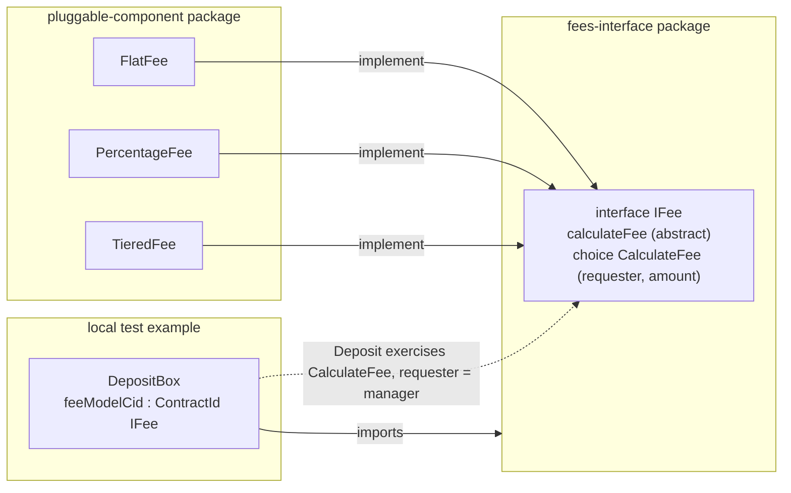

# Pluggable Component

## Overview

Use this pattern to decouple a main contract from the parts of its behavior
or configuration that are expected to change over time. The main contract
holds a `ContractId` of the interface and exercises its choice, while its
implementation is a different contract.

For example, a manager launches a vault with a flat fee to attract early
depositors. A year later the terms move to a percentage fee. Each new fee
schedule is a new implementation contract created on the manager's node, and
the vault points at it from then on. The vault contract, its open deposits,
and the packages installed on every depositor's participant stay exactly as
they were.

## The pattern

- An interface with a `viewtype`, an abstract function, and a nonconsuming
  choice that calls the function and enforces the shared invariants.
- Implementations are templates that define the function, each with its own
  `ensure` clause.
- The host imports the interface package only and holds a `ContractId` of the
  interface.
- The interface lives in its own package, separate from implementations.

## Benefits

- The host works with implementations written after it was deployed.
- A new policy is a new contract. No participant redeploys the host.
- Rules every implementation must respect are written once.

## Implementation example

The following choices are specific to this repository:

- The behavior is a fee calculation: `IFee` with `calculateFee` and the
  `CalculateFee` choice.
- Three implementations: `FlatFee` (fixed amount), `PercentageFee` (rate
  times amount), `TieredFee` (rate of the highest threshold reached).
- The host is [`DepositBox`](test/daml/DepositBox.daml), a simulated deposit
  contract whose only import is `IFee`. It lives in the test package to keep
  the demonstration local to this pattern.
- The example creates three boxes from the same template, each configured
  with a different fee model. A deposit of 1500 produces fees of 5, 30, and
  15 for the flat, percentage, and tiered configurations respectively.
  The existing fee model tests also call `CalculateFee` directly.

### Diagram



### Parties

- `manager`: signs the fee models and boxes, and exercises `Deposit`.
- `requester`: exercises `CalculateFee`. Passed as an argument.

### Contracts

- `IFee`: `FeeView` (`manager`, and `label`, a human-readable name for the
  model), `calculateFee : Decimal -> Decimal`,
  choice `CalculateFee` with `requester` and `amount`, controlled by
  `requester`.
- `FlatFee`, `PercentageFee`, `TieredFee`: signed by `manager`.
- `DepositBox`: signed by `manager`, holds `feeModelCid : ContractId IFee`.
  Its nonconsuming `Deposit` choice returns the gross amount, fee, and net
  amount. Deposits are simulated; no tokens move.

### Invariants

- `CalculateFee` rejects a non-positive amount and a fee outside
  `[0, amount]`.
- `PercentageFee` requires a rate in `[0, 1)`. `TieredFee` requires sorted
  tiers starting at zero.
- Swapping the fee model never changes the host package. In this example it
  is a new `DepositBox` contract with a new `feeModelCid`.

### Run the tests

```sh
make test-02-pluggable-component
```
