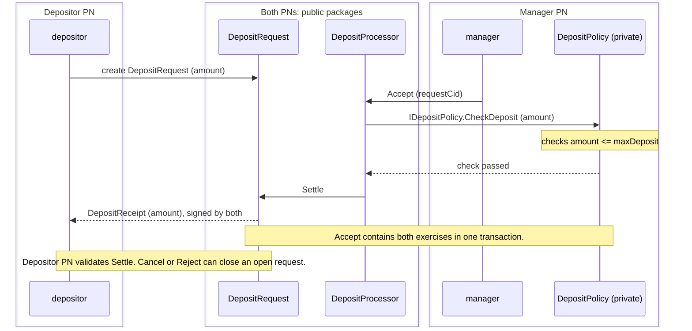

# Public-Private DAR File Split

## Overview

Use this pattern when part of a workflow's logic must stay private or needs
high-frequency updates.

The split cuts the code into three DAR file layers with one dependency
direction: interface, public, and private. Counterparties vet the interface
and public packages. The manager institution vets all three.

## The pattern

| Layer | Contains | Depends on | Vetted on |
| --- | --- | --- | --- |
| Interface | Daml interfaces and their views. No templates. | Standard library | Every PN |
| Public | Contracts counterparties sign or observe, and the manager's contract that calls the interface through a `ContractId`. | Interface | Every PN |
| Private | Private business logic. | Interface | Institution's PN |

The manager's contract calls the private implementation and the public
settlement as sibling exercises under one choice controlled by the manager,
so both commit in one transaction and counterparties validate only the public
branch.

## Benefits

- Counterparties install two DAR files and never receive the private one.
- Private changes never touch the public layer or any other participant.
- Private logic and data stay on the institution's PN.
- The private check and the public settlement commit in one transaction.

## Limitations

- Choices with a controller other than the manager cannot be implemented in
  the private layer. A counterparty that controls a choice must vet the
  package that defines it, which would put the private package on its PN.

## Implementation example

The private behavior shown is a deposit limit. The same three layers hold for
a fee schedule, an eligibility rule, or any other computation the institution
keeps to itself.

### Packages

1. `deposit-interface` (`interface/`): `IDepositPolicy` with `DepositPolicyView`
   and the nonconsuming `CheckDeposit` choice.
2. `deposit-public` (`public/`): `DepositRequest`, `DepositProcessor`, and
   `DepositReceipt`. `DepositProcessor.policyCid` is a
   `ContractId IDepositPolicy`.
3. `deposit-policy` (`private/`): `DepositPolicy`, which implements
   `IDepositPolicy` with a `maxDeposit` limit.

The sandbox verifies package separation for one implementation; an upgrade
between package versions is outside this example. Token transfers are outside
this example; `Settle` records a receipt.

### Flow



#### Contracts and choices

- **`DepositRequest`**: signed by the depositor, observed by the manager.
  Fixes a positive amount. `Cancel` belongs to the depositor; `Reject` and
  `Settle` belong to the manager. Each choice consumes the request.
- **`DepositProcessor`**: signed by the manager, observed by the depositor.
  Its nonconsuming `Accept` checks that the request matches both parties,
  calls the policy through `IDepositPolicy`, then exercises `Settle`.
- **`DepositPolicy`**: signed by the manager. Implements the interface's
  nonconsuming `CheckDeposit`, requiring a positive amount within `maxDeposit`.
- **`DepositReceipt`**: signed by both parties, created by `Settle` with the
  original request amount. Token transfers are outside this example.

The request's signature supplies the depositor's authorization for the receipt.
The manager submits as itself only.

#### Why `Accept` lives on the processor

The depositor observes the processor, so it can see the contract and its
interface-typed policy reference. The manager submits `Accept` directly as the
root exercise. It is nonconsuming and the manager is the processor's sole
signatory and the choice's controller. Contract observers are excluded from the
informees of a nonconsuming exercise unless they also have another informing
role. The policy branch therefore stays manager-only.

`Settle` is a sibling of `CheckDeposit`. It exercises the depositor-signed
request, making that settlement and its receipt visible to both parties.

Putting `Accept` on the depositor-signed request would make the depositor a
witness of its nested policy call. An interface preserves that visibility.
In an isolated two-PN check, this arrangement failed package resolution while
the private DAR file was absent from the depositor PN. It succeeded after
uploading that file there, exposing both `Accept` and `CheckDeposit` to the depositor.
See Canton's [privacy rules](https://docs.digitalasset.com/overview/3.5/explanations/ledger-model/ledger-privacy.html).

The manager can also call `Settle` directly. The policy is an internal decision
rule; the receipt records the manager's acceptance of the authorized amount.

### Run the tests

From the repository root:

```sh
make test-03-public-private-split
make sandbox-public-private
```

The two Daml tests cover an accepted deposit and rejection by the private limit.
The sandbox starts two in-memory PNs, a sequencer, and a mediator. It uploads
the public DAR file (including its interface dependency) to both PNs and the
private DAR file to the manager PN only, then checks:

- The manager sees `Accept`, `CheckDeposit` through `IDepositPolicy`, and `Settle`.
- The depositor sees the processor contract and only the `Settle` exercise.
  The private policy contract and package remain absent from its PN.
- Both parties see the same receipt for 1,500 under the same transaction ID.
  The request is consumed and the depositor's package inventory stays unchanged.
