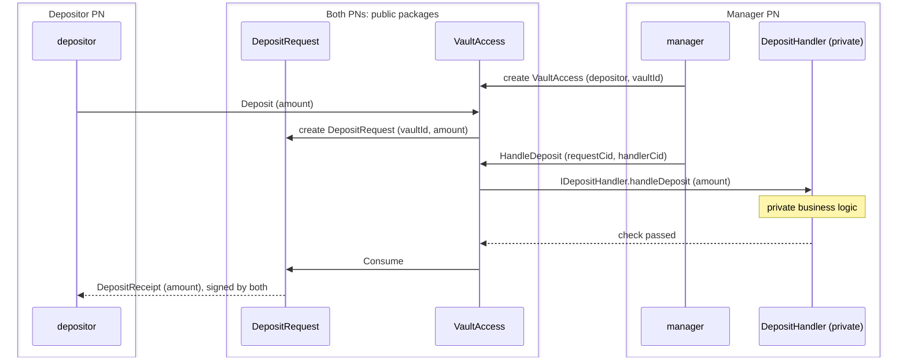

# Public-Private DAR File Split

## Overview

Use this pattern when part of a workflow's logic must stay private or needs
high-frequency updates.

The split cuts the code into three DAR file layers with one dependency
direction: interface, public, and private. Counterparties vet the interface
and public packages. The manager institution vets all three.

## The pattern

| Layer | Contains | Depends on | Vetted on |
| --- | --- | --- | --- |
| Interface | Daml interfaces and their views. No templates. | Standard library | Every PN |
| Public | Contracts counterparties sign or observe, and the manager's contract that calls the interface through a `ContractId`. | Interface | Every PN |
| Private | Private business logic. | Interface | Institution's PN |

The manager's contract calls the private implementation and the public
settlement as sibling exercises under one choice controlled by the manager,
so both commit in one transaction and counterparties validate only the public
branch.

## Benefits

- Counterparties install two DAR files and never receive the private one.
- Private changes never touch the public layer or any other participant.
- Private logic and data stay on the institution's PN.
- The private check and the public settlement commit in one transaction.

## Limitations

- Choices with a controller other than the manager cannot be implemented in
  the private layer. A counterparty that controls a choice must vet the
  package that defines it, which would put the private package on its PN.

## Implementation example

The private behavior shown is a deposit limit. The same three layers hold for
a fee schedule, an eligibility rule, or any other computation the institution
keeps to itself.

### Packages

1. `deposit-interface` (`interface/`): `IDepositHandler` declares the
   `handleDeposit` method. Its `DepositHandlerInfo` view exposes the manager.
2. `deposit-public` (`public/`): `VaultAccess`, `DepositRequest`, and
   `DepositReceipt`. `VaultAccess.HandleDeposit` receives a request CID and a
   `ContractId IDepositHandler`.
3. `deposit-handler` (`private/`): `DepositHandler` implements `IDepositHandler`
   with a private `maxDeposit` limit.

The sandbox verifies package separation for one implementation; an upgrade
between package versions is outside this example. Token transfers are outside
this example; `Consume` records a receipt without transferring assets or issuing
shares.

### Flow



`HandleDeposit` is nonconsuming, the manager is the sole signatory of
`VaultAccess`, and the depositor is a contract observer. This keeps the private
processing outside the depositor's validation scope.

`Consume` consumes the request and carries the depositor's authorization to
create a receipt signed by both parties. The manager can also call `Consume`
directly; the private limit is an internal processing rule.

### Run the tests

From the repository root:

```sh
make test-03-public-private-split
make sandbox-public-private
```

The two Daml tests cover an accepted deposit and rejection by the private limit.
The sandbox starts two in-memory PNs, a sequencer, and a mediator. It uploads
the public DAR file (including its interface dependency) to both PNs and the
private DAR file to the manager PN only. The expected flow is:

- The depositor creates the request through `VaultAccess.Deposit`.
- During processing, the manager sees `HandleDeposit` and `Consume`; the
  depositor sees `Consume`. The private handler contract and package remain
  absent from the depositor's PN.
- Both parties see the same receipt for 1,500 under the same transaction ID.
  The request is consumed and the depositor's package inventory stays unchanged.
